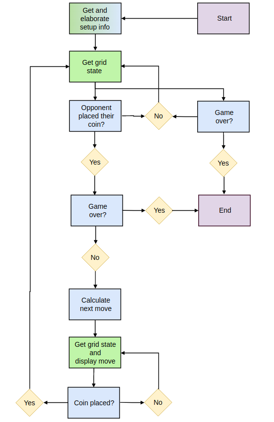

# FPGA connect four

The project concerns the creation of a system that is able to challenge a human player in the [connect 4](https://en.wikipedia.org/wiki/Connect_Four) game.

The system was built with the help of Fabio Deo and Agrim Manchanda as a first year unversity project.

## Components

The system is comprised of:
- a physical board to play connect four (for the demo, it was printed on paper).
- connect four red and blue disks.
- a camera pointing to the game board.
- a System On Chip (SoC) with an ARM processor and an FPGA receiving the live stream from the camera.

## System overview

The system receives input via a camera stream, which is used to extract the state of the grid. This stream processing is done in hardware on the FPGA of the SoC.

The information about the game state are then passed to the very-optimised Minimax python algorithm that runs on the SoC ARM CPU. Such a CPU is relatively slow, so the algorithm has to be extremely efficient.

Each time the player inserts a coin, the system calculates its move and asks a user to insert a coin in that position.

